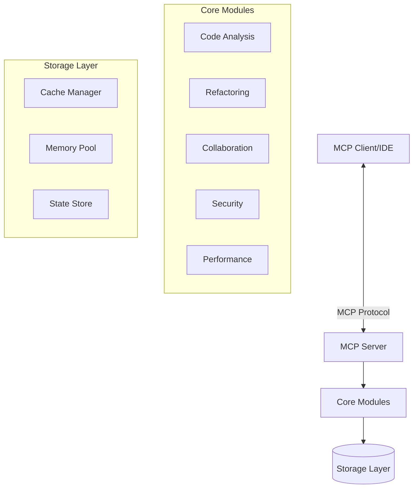

# MCP Ballerina Server Architecture

## System Overview

The MCP Ballerina Server is a comprehensive language server implementation that provides code analysis, refactoring, collaboration, security scanning, and performance optimization capabilities for Ballerina programming language through the Model Context Protocol (MCP).

## High-Level Architecture



## Component Architecture

### 1. MCP Integration Layer

**Purpose**: Bridge between MCP protocol and Ballerina modules

**Components**:
- **Request Router**: Routes MCP tool calls to appropriate handlers
- **Response Formatter**: Formats module responses for MCP
- **Error Handler**: Standardizes error responses
- **Authentication**: Validates MCP client credentials

**Key Classes**:
```ballerina
public class MCPServer {
    private map<ToolHandler> handlers;
    private AuthManager authManager;
    
    public function handleRequest(json request) returns json|error;
    public function registerTool(Tool tool, ToolHandler handler);
}
```

### 2. Code Analysis Module

**Purpose**: Parse and analyze Ballerina source code

**Architecture**:
```
┌─────────────────────────────────────┐
│        Code Analysis Module          │
├─────────────────────────────────────┤
│  ┌─────────────────────────────┐   │
│  │      AST Parser              │   │
│  │  - Lexical Analysis          │   │
│  │  - Syntax Analysis           │   │
│  │  - Error Recovery            │   │
│  └─────────────────────────────┘   │
│  ┌─────────────────────────────┐   │
│  │    Semantic Analyzer         │   │
│  │  - Type Checking             │   │
│  │  - Scope Resolution          │   │
│  │  - Symbol Table              │   │
│  └─────────────────────────────┘   │
│  ┌─────────────────────────────┐   │
│  │      LSP Handlers            │   │
│  │  - Completion                │   │
│  │  - Hover                     │   │
│  │  - Go to Definition          │   │
│  └─────────────────────────────┘   │
└─────────────────────────────────────┘
```

**Data Flow**:
1. Source code → Lexer → Tokens
2. Tokens → Parser → AST
3. AST → Semantic Analyzer → Annotated AST
4. Annotated AST → LSP Handlers → IDE Features

### 3. Refactoring Module

**Purpose**: Automated code transformations

**Components**:
- **Refactor Engine**: Orchestrates refactoring operations
- **AST Transformer**: Modifies AST nodes
- **Code Generator**: Converts AST back to source
- **Template Manager**: Manages code templates
- **Quick Fix Provider**: Suggests automatic fixes

**Refactoring Pipeline**:
```
Input Code → Parse → Transform AST → Validate → Generate Code → Format → Output
```

### 4. Collaboration Module

**Purpose**: Real-time collaborative editing

**Architecture**:
```
┌─────────────────────────────────────┐
│      Collaboration Module            │
├─────────────────────────────────────┤
│  ┌─────────────────────────────┐   │
│  │   WebSocket Server           │   │
│  │  - Connection Management     │   │
│  │  - Message Broadcasting      │   │
│  └─────────────────────────────┘   │
│  ┌─────────────────────────────┐   │
│  │   OT Engine                  │   │
│  │  - Transform Operations      │   │
│  │  - Conflict Resolution       │   │
│  └─────────────────────────────┘   │
│  ┌─────────────────────────────┐   │
│  │   Presence Manager           │   │
│  │  - User Tracking             │   │
│  │  - Cursor Management         │   │
│  └─────────────────────────────┘   │
└─────────────────────────────────────┘
```

**Operational Transform Algorithm**:
1. Receive concurrent operations
2. Transform based on document state
3. Apply transformed operations
4. Broadcast to all clients
5. Maintain consistency

### 5. Security Module

**Purpose**: Static security analysis and vulnerability detection

**Components**:
- **Security Analyzer**: SAST implementation
- **Taint Analysis Engine**: Tracks data flow
- **Vulnerability Scanner**: Checks dependencies
- **Rule Engine**: Manages security rules
- **Reporter**: Generates security reports

**Security Analysis Pipeline**:
```
Source → Parse → Build CFG → Taint Analysis → Pattern Matching → Report
         ↓                      ↓                    ↓
      AST/Symbols          Data Flow Graph    Vulnerability DB
```

### 6. Performance Module

**Purpose**: Optimization and caching

**Architecture**:
```
┌─────────────────────────────────────┐
│      Performance Module              │
├─────────────────────────────────────┤
│  ┌─────────────────────────────┐   │
│  │    Cache Manager             │   │
│  │  - Multi-level Cache         │   │
│  │  - Eviction Policies         │   │
│  │  - TTL Management            │   │
│  └─────────────────────────────┘   │
│  ┌─────────────────────────────┐   │
│  │   Parallel Processor         │   │
│  │  - Worker Pools              │   │
│  │  - Task Scheduling           │   │
│  │  - Map-Reduce                │   │
│  └─────────────────────────────┘   │
│  ┌─────────────────────────────┐   │
│  │   Memory Optimizer           │   │
│  │  - Object Pooling            │   │
│  │  - GC Optimization           │   │
│  └─────────────────────────────┘   │
└─────────────────────────────────────┘
```

## Data Models

### AST Node Structure
```ballerina
public type ASTNode record {|
    string 'type;
    Position position;
    ASTNode[] children;
    map<anydata> properties;
    SymbolInfo? symbol;
|};
```

### Symbol Information
```ballerina
public type SymbolInfo record {|
    string name;
    SymbolKind kind;
    string 'type;
    Position position;
    Scope scope;
    boolean exported;
|};
```

### Security Vulnerability
```ballerina
public type Vulnerability record {|
    string id;
    string title;
    string description;
    Severity severity;
    Location location;
    string cweId;
    string owaspCategory;
    string remediation;
|};
```

## Communication Patterns

### Request-Response Pattern
Used for: Code analysis, refactoring, security scanning

```
Client → Request → Server → Process → Response → Client
```

### Publish-Subscribe Pattern
Used for: Real-time collaboration, presence updates

```
Client → Subscribe → Topic
Server → Publish → Topic → All Subscribers
```

### Pipeline Pattern
Used for: Complex processing workflows

```
Input → Stage1 → Stage2 → Stage3 → Output
         ↓         ↓         ↓
       Cache    Cache     Cache
```

## Caching Strategy

### Multi-Level Cache Architecture
```
L1 Cache (Memory) → L2 Cache (Disk) → Source
    ↓                    ↓
  Hot Data          Warm Data
```

### Cache Eviction Policies
- **LRU (Least Recently Used)**: Default for AST cache
- **LFU (Least Frequently Used)**: For symbol cache
- **TTL (Time To Live)**: For security scan results
- **FIFO (First In First Out)**: For temporary data

## Concurrency Model

### Worker Pool Architecture
```ballerina
public type WorkerPool record {|
    int corePoolSize;
    int maxPoolSize;
    int queueCapacity;
    worker[] workers;
|};
```

### Parallel Execution Strategy
1. **Task Decomposition**: Break into subtasks
2. **Work Distribution**: Assign to workers
3. **Execution**: Parallel processing
4. **Result Aggregation**: Combine results
5. **Error Handling**: Graceful degradation

## Security Architecture

### Defense in Depth
```
Input Validation → Sanitization → Processing → Output Encoding
        ↓              ↓              ↓            ↓
    Rate Limiting  Auth Check    Audit Log    Error Handling
```

### Threat Model
- **Input Validation**: Prevent injection attacks
- **Authentication**: JWT-based auth for WebSocket
- **Authorization**: Role-based access control
- **Encryption**: TLS for communication
- **Audit**: Comprehensive logging

## Performance Optimization

### Optimization Techniques
1. **Lazy Loading**: Load resources on demand
2. **Object Pooling**: Reuse expensive objects
3. **Batch Processing**: Group operations
4. **Async Processing**: Non-blocking operations
5. **Memory Management**: Efficient GC usage

### Performance Metrics
```ballerina
public type PerformanceMetrics record {|
    decimal avgResponseTime;
    int throughput;
    decimal cpuUsage;
    int memoryUsage;
    decimal cacheHitRate;
|};
```

## Scalability Considerations

### Horizontal Scaling
```
Load Balancer
    ↓
┌────────┐  ┌────────┐  ┌────────┐
│Server 1│  │Server 2│  │Server 3│
└────────┘  └────────┘  └────────┘
    ↓           ↓           ↓
    Shared Cache/State Store
```

### Vertical Scaling
- Increase worker pool size
- Expand cache capacity
- Optimize memory usage
- Tune GC parameters

## Deployment Architecture

### Container Deployment
```dockerfile
FROM ballerina/ballerina:2201.8.0
COPY . /app
WORKDIR /app
EXPOSE 9090
CMD ["bal", "run", "main.bal"]
```

### Kubernetes Deployment
```yaml
apiVersion: apps/v1
kind: Deployment
metadata:
  name: mcp-ballerina-server
spec:
  replicas: 3
  selector:
    matchLabels:
      app: mcp-ballerina
  template:
    spec:
      containers:
      - name: server
        image: mcp-ballerina:latest
        ports:
        - containerPort: 9090
```

## Monitoring and Observability

### Metrics Collection
- **Application Metrics**: Response time, throughput
- **System Metrics**: CPU, memory, disk I/O
- **Business Metrics**: Feature usage, error rates

### Logging Strategy
```ballerina
public type LogEntry record {|
    string timestamp;
    LogLevel level;
    string component;
    string message;
    map<anydata> context;
|};
```

### Distributed Tracing
```
Request → [Span: Parse] → [Span: Analyze] → [Span: Cache] → Response
              ↓                ↓                 ↓
          Trace Context    Trace Context    Trace Context
```

## Error Handling Strategy

### Error Classification
1. **Recoverable Errors**: Retry with backoff
2. **Client Errors**: Return 4xx status
3. **Server Errors**: Return 5xx status
4. **Fatal Errors**: Graceful shutdown

### Error Recovery
```ballerina
public function resilientOperation() returns any|error {
    int retries = 3;
    decimal backoff = 1.0;
    
    foreach int i in 0 ..< retries {
        var result = attemptOperation();
        if result is error {
            if i == retries - 1 {
                return result;
            }
            runtime:sleep(backoff);
            backoff = backoff * 2;
        } else {
            return result;
        }
    }
}
```

## Future Architecture Enhancements

### Planned Improvements
1. **Microservices Architecture**: Separate modules into services
2. **Event Sourcing**: Complete audit trail
3. **CQRS Pattern**: Separate read/write models
4. **GraphQL Support**: Flexible API queries
5. **AI Integration**: ML-based code suggestions

### Technology Roadmap
- **Phase 1**: Core functionality (Complete)
- **Phase 2**: Cloud-native features
- **Phase 3**: AI/ML integration
- **Phase 4**: Federation support

## Conclusion

The MCP Ballerina Server architecture is designed for:
- **Modularity**: Clear separation of concerns
- **Scalability**: Horizontal and vertical scaling
- **Performance**: Optimized for speed and efficiency
- **Security**: Defense in depth approach
- **Maintainability**: Clean code and documentation

This architecture ensures the system can evolve to meet future requirements while maintaining stability and performance.